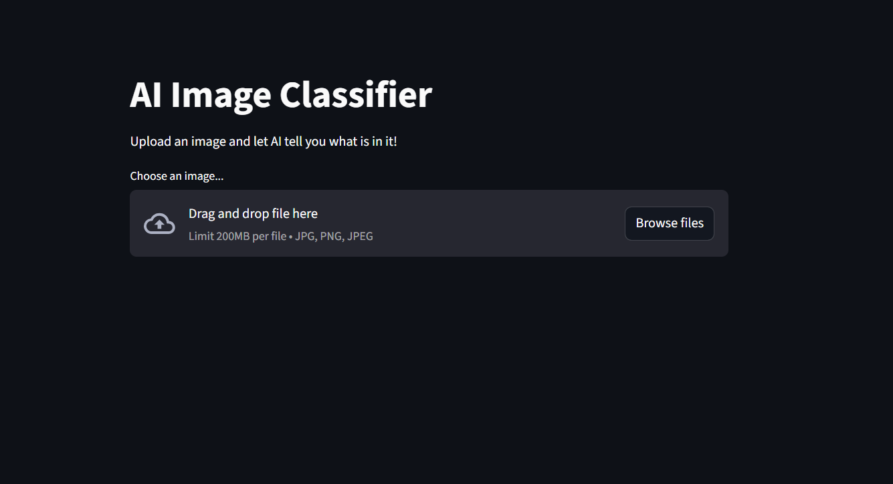
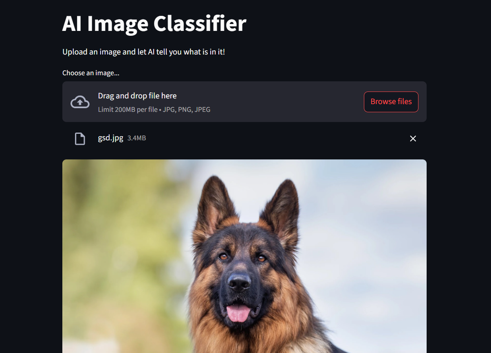
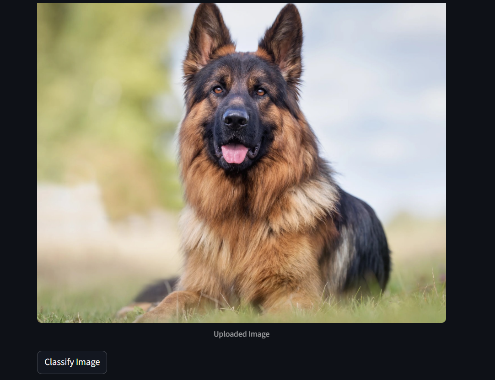
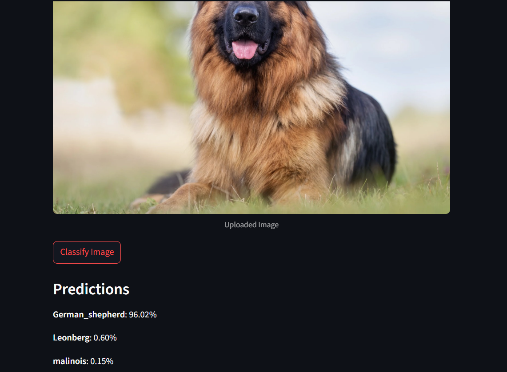

# AI Image Classifier

A simple web app that classifies images using a pre-trained MobileNetV2 deep learning model. Built with Streamlit for an easy and interactive user interface.

---

## Features

- Upload images (`jpg`, `png`) for classification.
- Uses TensorFlow's MobileNetV2 model pretrained on ImageNet.
- Displays top 3 predictions with confidence scores.
- Image preprocessing using OpenCV and TensorFlow utilities.
- Model loading optimized with Streamlit caching.

---

## Requirements

- Python 3.11+
- TensorFlow
- Streamlit
- OpenCV-Python
- Pillow (PIL)

---

## Screenshots

  
---

  
---

  
---

  
